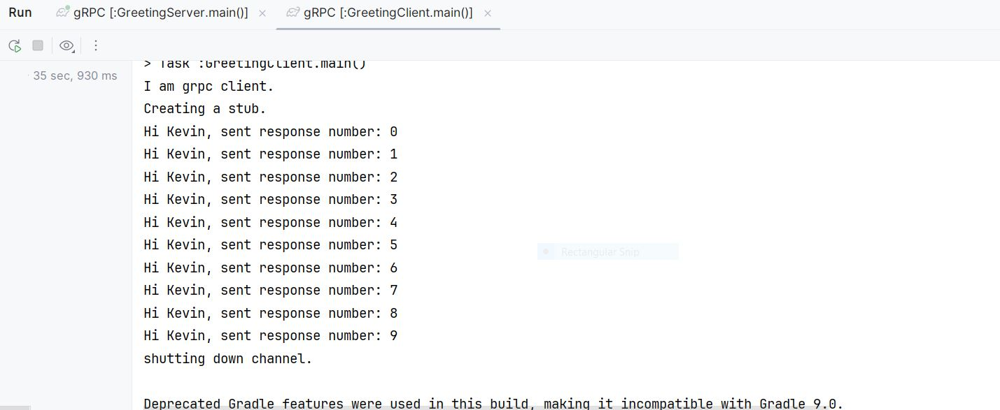

# SERVER STREAMING RPCs
***********************
## overview of this API of the gRPC
**************************************

The Client sends a single request to the server and receives a stream of responses.  The server can send
multiple messages back to the client over the same connection. 
Enabled by HTTP/2.

use case: Useful for scenarios where the response is large or needs to be sent incrementally, 
such as streaming logs or search results. i.e., 
A request to receive a stream of updates or events related to a particular topic 

** Syntax: rpc ListUserActivities(UserRequest) returns (stream UserActivity);

