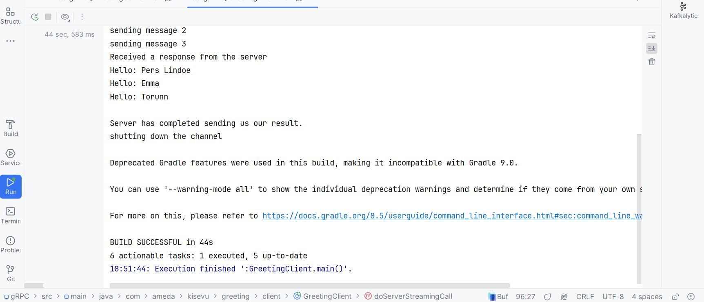

# CLIENT STREAMING RPCs
***********************
## overview of this API of the gRPC
**************************************

Client sends a stream of requests to the server and receives a single response.
The server processes the stream of requests and responds once all requests are received.
#### use case: Suitable for cases where the client needs to send multiple messages in a batch and then receive a single result,
such as sending large amounts of data for processing. i.e A request to upload a file in chunks where the server processes the
the entire file and send a confirmation once processing is complete.
rcp UploadFile(stream FileChunk) returns (UploadResponse);

In my use case, it will take MANY LongGreetRequest that contains a Greeting.
It will return ONE LongGreetResponse that contains a result string.

